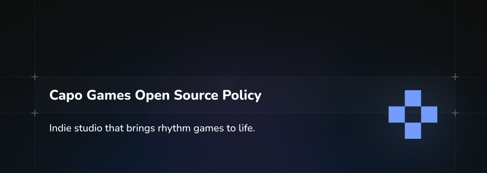

# Organization Policy & Licensing Overview

Welcome! This document outlines how projects under this organization may be used, contributed to, and shared.

> **Note:** This is a high-level policy summary for convenience only and does not replace the actual license files in each repository. In case of any conflict, the license in the individual repository always takes precedence.

---

## 1. Open Source Projects

We maintain a number of open source repositories. Unless otherwise stated in a project’s own `LICENSE` file:

- **Contributions are welcome.**  
  You are encouraged to open issues, submit pull requests, and propose improvements to any open source repository in this organization.

- **Default license: GNU Affero General Public License (AGPL).**  
  Public/source-available projects are, by default, licensed under the GNU Affero General Public License (AGPL), unless a different license is explicitly specified in the repository.

- **Your contributions.**  
  By submitting a contribution (e.g. via pull request), you agree that your contribution will be licensed under the same license as the repository it is submitted to, unless otherwise clearly agreed in writing.

Please always check the `LICENSE` and `CONTRIBUTING` files (if present) in each repository before using or contributing to the code.

---

## 2. Non-Commercial Protection of Resources

All resources in this organization that are marked or described as **non-commercial** (for example, certain documentation, design assets, media, or other content) are provided **for non-commercial use only**, unless you receive explicit written permission stating otherwise.

In practical terms, this means:

- You **may not** use non-commercial resources for commercial products, services, or other profit-generating activities without prior written permission.
- You **may** use them for personal, educational, research, or other non-commercial purposes, subject to any additional terms specified in the relevant repository.

This includes `Audio Files`, `Image Files`, `Binary/Precompiled Files`.

When in doubt, please refer to the repository’s `LICENSE` or other notices, or contact us for clarification.

---

## 3. Closed Source / Proprietary Projects

Some repositories and projects within this organization are **closed source** and **proprietary**.

For these proprietary projects:

- The source code is **not licensed for redistribution, modification, or public sharing**.
- Any copying, distribution, or publication of the code or other proprietary materials without explicit written permission from us is **strictly prohibited** and may be unlawful in your jurisdiction.
- Access to such code (if granted) is typically for evaluation, internal use, or other limited purposes as defined by separate agreements or terms of use.

If you are unsure whether a project is open source or proprietary, check the repository’s visibility and licensing information. When a repository does **not** include an open source license, you should assume that **all rights are reserved**.

---

## 4. Trademarks, Branding & Logos

Any names, logos, or other branding elements associated with `CAPO GAMES` organization are our property (or the property of our licensors):

- You may not use them in a way that suggests endorsement or affiliation without written permission.
- You may not modify or reuse our logos or branding for commercial purposes unless explicitly authorized.

---

## 5. Legal Notice & Contact

Nothing in this document constitutes legal advice. Licensing, intellectual property, and related matters can be complex and may vary by jurisdiction. If you require certainty, you should consult a qualified legal professional.

If you have questions about:

- Using our code or resources,
- Commercial licensing or special permissions,
- Or any other legal/usage concerns,

please contact us via the channels listed in this organization’s profile or in the relevant repository.

---

Thank you for respecting these policies and helping us maintain a healthy, collaborative environment for everyone.
